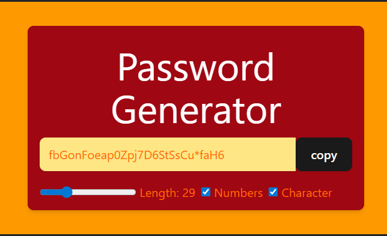

🔐 Password Generator (React.js)
A modern and customizable Password Generator built with React.js and styled using Tailwind CSS.
Easily generate strong passwords with adjustable length, numbers, and special characters — plus instant copy-to-clipboard.

🚀 Features
📏 Adjustable password length (6–100 characters)

🔢 Option to include numbers

🔣 Option to include special characters

📋 One-click copy to clipboard with confirmation message

⚡ Real-time password generation as you change settings

🎨 Simple and responsive UI with Tailwind CSS

🛠️ Tech Stack
React.js (Vite setup)

JavaScript (ES6+)

Tailwind CSS

📂 Installation & Setup
bash
Copy
Edit
# Clone the repository
git clone https://github.com/yourusername/password-generator.git

# Navigate to project folder
cd password-generator

# Install dependencies
npm install

# Start development server
npm run dev
📜 Usage
Move the length slider to select desired password length

Enable/disable Numbers or Special Characters with checkboxes

Password updates instantly based on preferences

Click Copy to copy it to your clipboard

💡 Future Improvements
Password strength meter

Dark mode toggle

Option to exclude similar-looking characters (O, 0, l, 1, etc.)

